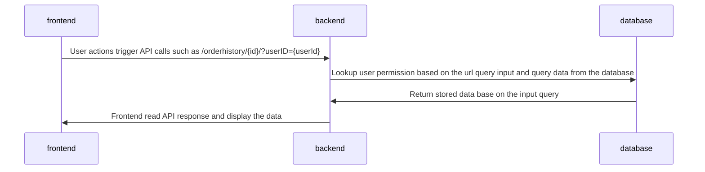
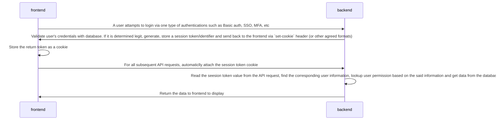

> • Discuss how you would enforce limiting users to only see their
> orders or orders that other users allowed them to see. 
> 
> • Present a guide of how someone would implement this in your project


# Introduction

At the day May 25th, 2018, [General Data Protection Regulation(GDPR)](https://gdpr-info.eu/) became applicable. This European regulation restricted how a business can collect and use user data. Since the CSI5112-Project(the project) is designed to be used by public, it is important that the project respect the regulation, so it can be used in European markets. As of today, the project does not follow the industry best practices in order to protect user's privacy due to the scope and timeline limitation of the project. This document is created to discuss future possible design iterations to address this issue. 


# Current Status 

Currently, there are a few privacy related requirements in the project:
* The buyer shall view their own order history
* The merchant shall view all buyers' order history

The current implementation to control the above discussed requirements is:


This design has a major security defeat because the permission control solely relies on the `userID` input that can be easily manipulated. The following sections will discuss steps to resolve this security defeat. 

# Possible Solutions

## Task 1: User Authentication and Session Management

### Proposed Solution  
In order to maintain the current user information in the system and ensure this information cannot be maliciously manipulated, the user information needs to be communicated and stored in a secure and encrypted way instead of passing the user id directly in plain text. Currently, the industry standard is to use cookies to perform user session management. A simplified workflow is:


In this workflow, user information is read-only. The ability to set the current user in a given session never left the backend. Only one session token/identifier (a randomly generated meaningless string) is communicated between frontend and backend. With this approach, user information is maintained and managed via a "placeholder" and the said "placeholder" is hard to manipulate while maintaining its validation. 

### Implementation

ASP.NET Core has a built-in [session management package](https://docs.microsoft.com/en-us/aspnet/core/fundamentals/app-state?view=aspnetcore-6.0). The developer can follow the tutorial to enable the session management for the project. 

On the frontend side, [flutter_session](https://pub.dev/packages/flutter_session) package is available. It allows developers to store and retrieve any string (session cookie in this use case) globally.

Once the system is ready to utilize session management, the developer can implement the following pseudocode:
```python
# Setup backend session
def login(request):
    auth = request.auth
    if not validate(auth):
        raise AuthError()
    user = find_user_via_auth(auth)
    session.add(user)
    return api_ok(session.cookie)

# Setup frontend session
def login(auth):
    res = send_api_request(auth)
    set_cookie(res.cookie.session)
    

# Use backend session
def search_order_history(request):
    session = request.cookie.session
    if not validate(session):
        raise AuthError()
    user = find_user_via_session(session)
    order_history = send_db_query(user.permission)
    return api_ok(order_histroy)

# Use frontend session
def display_order_history():
    res = send_api_request_search_order_history(cookie.session)
    display(res.order_histroy_data)
```


### Alternative Consideration

#### Attach user auth to every API requests

An alternative approach is to consider all API requests from the frontend independent. For every request originated from frontend, a basic auth (or other type of one-step authentication method) is attached to the request. Once the backend receives the request, it validates the authentication and compute the value. 

Due to the following shortcoming, this approach is abandoned:
* It is unrealistic to implement MFA or SSO since those authentication approaches require user actions.
* Since it is unrealistic to ask user to input the authentication for every request the project may make in real time, the authentication has to be stored somewhere locally which can be looked up by malicious actors or software programs.
* It may reduce the request turn around time due to the extra authentication computation on the backend side. 


## Task 2: Define Scope of All READ Operations

### Proposed Solution 

As mentioned in the previous sections, once the user information and its permission scope is retrieved, the system should use the knowledge to query database data. To do that, for every single endpoint, if the result may be impact by user permission, a custom logic is required to alter the base query based on the scope before sending the query to the database. 

A few benefits of this approach are:
* If the criteria to define the permission scope is indexed, the database computation time can be reduced by utilizing the indexes. 
* The backend may be able to early return some invalid queries to reduce database workload.

### Implementation

The pseudocode of order history search can be:
```python
def search_order_history(request):
    session = request.cookie.session
    if not validate(session):
        raise AuthError()
    user = find_user_via_session(session)
    order_history = send_db_query(user.permission)
    return api_ok(order_histroy)

def send_db_query(permission):
    base_query = Order_history.query
    if permission == "buyer":
        # Append scope to the query
        return base_query.filter(Order_history.user==permission.user).all()
    elif permission == "merchant":
        # Return all results
        return base_query.all()
    else:
        # invalid permission
        return []
```

### Alternative Consideration
post-db server side filter 

fe filter 


## Task 3: Error Headlining for Unauthorised READ Operations

### Proposed Solution 

return empty results 

tell use not Unauthorised and provide solution 

prevent user from do the op

### Implementation


## Additional Privacy Assurance Enhancement 

### Physical Isolation 
db per user

### Audit Logs
recover if bad thing happened 

### Grant Permission
allow users to view other users history

