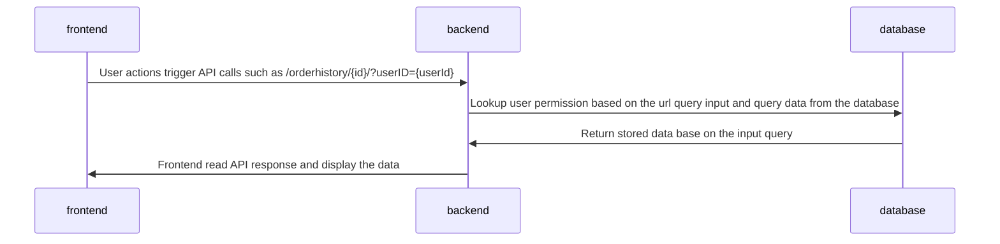
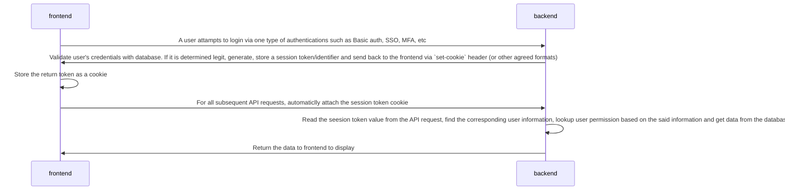

# Introduction

At the day May 25th, 2018, [General Data Protection Regulation(GDPR)](https://gdpr-info.eu/) became applicable. This European regulation restricted how a business can collect and use user data. Since the CSI5112-Project(the project) is designed to be used by public, it is important that the project respect the regulation, so it can be used in European markets. As of today, the project does not follow the industry best practices in order to protect user's privacy due to the scope and timeline limitation of the project. This document is created to discuss future possible design iterations to address this issue. 


# Current Status 

Currently, there are a few privacy related requirements in the project:
* The buyer shall view their own order history
* The merchant shall view all buyers' order history

The current implementation to control the above discussed requirements is:


This design has a major security defeat because the permission control solely relies on the `userID` input that can be easily manipulated. The following sections will discuss steps to resolve this security defeat. 

# Possible Solutions

## Task 1: User Authentication and Session Management

### Proposed Solution  
In order to maintain the current user information in the system and ensure this information cannot be maliciously manipulated, the user information needs to be communicated and stored in a secure and encrypted way instead of passing the user id directly in plain text. Currently, the industry standard is to use cookies to perform user session management. A simplified workflow is:


In this workflow, user information is read-only. The ability to set the current user in a given session never left the backend. Only one session token/identifier (a randomly generated meaningless string) is communicated between frontend and backend. With this approach, user information is maintained and managed via a "placeholder" and the said "placeholder" is hard to manipulate while maintaining its validation. 

### Implementation

ASP.NET Core has a built-in [session management package](https://docs.microsoft.com/en-us/aspnet/core/fundamentals/app-state?view=aspnetcore-6.0). The developer can follow the tutorial to enable the session management for the project. 

On the frontend side, [flutter_session](https://pub.dev/packages/flutter_session) package is available. It allows developers to store and retrieve any string (session cookie in this use case) globally.

Once the system is ready to utilize session management, the developer can implement the following pseudocode:
```python
# Setup backend session
def login(request):
    auth = request.auth
    if not validate(auth):
        raise AuthError()
    user = find_user_via_auth(auth)
    session.add(user)
    return api_ok(session.cookie)

# Setup frontend session
def login(auth):
    res = send_api_request(auth)
    set_cookie(res.cookie.session)
    

# Use backend session
def search_order_history(request):
    session = request.cookie.session
    if not validate(session):
        raise AuthError()
    user = find_user_via_session(session)
    order_history = send_db_query(user.permission)
    return api_ok(order_histroy)

# Use frontend session
def display_order_history():
    res = send_api_request_search_order_history(cookie.session)
    display(res.order_histroy_data)
```


### Alternative Consideration

#### Attach user auth to every API requests

An alternative approach is to consider all API requests from the frontend independent. For every request originated from frontend, a basic auth (or other type of one-step authentication method) is attached to the request. Once the backend receives the request, it validates the authentication and compute the value. 

Due to the following shortcoming, this approach is abandoned:
* It is unrealistic to implement MFA or SSO since those authentication approaches require user actions.
* Since it is unrealistic to ask user to input the authentication for every request the project may make in real time, the authentication has to be stored somewhere locally which can be looked up by malicious actors or software programs.
* It may reduce the request turn around time due to the extra authentication computation on the backend side. 


## Task 2: Define Scope of All READ Operations

### Proposed Solution 

As mentioned in the previous sections, once the user information and its permission scope is retrieved, the system should use the knowledge to query database data. To do that, for every single endpoint, if the result may be impact by user permission, a custom logic is required to alter the base query based on the scope before sending the query to the database. 

A few benefits of this approach are:
* If the criteria to define the permission scope is indexed, the database computation time can be reduced by utilizing the indexes. 
* The backend may be able to early return some invalid queries to reduce database workload.

### Implementation

The pseudocode of order history search can be:
```python
# Backend code
def search_order_history(request):
    session = request.cookie.session
    if not validate(session):
        raise AuthError()
    user = find_user_via_session(session)
    order_history = send_db_query(user.permission)
    return api_ok(order_histroy)

def send_db_query(permission):
    base_query = Order_history.query
    if permission == "buyer":
        # Append scope to the query
        return base_query.filter(Order_history.user==permission.user).all()
    elif permission == "merchant":
        # Return all results
        return base_query.all()
    else:
        # invalid permission
        return []
```

### Alternative Consideration

#### Backend Filter Post Database Search
One alternative can be done is to perform the permission scoped filter against the retrieved database data. For example, one version of pseudocode can be:
```python
# backend code
def search_order_history(request):
    session = request.cookie.session
    if not validate(session):
        raise AuthError()
    user = find_user_via_session(session)
    order_history = Order_history.query.all()
    
    # Filter here
    order_history = order_history.filter_by(user.permission)
    
    return api_ok(order_histroy)
```
The downside of this approach is that the system could not utilize existing indexes in the database and can only perform a CPU based in memory filter based on basic algorithm which may not be able to handle huge dataset and have a reduced performance comparing to the proposed approach. Therefore, this approach is abandoned. 
#### Frontend Filter

Another approach is to allow backend to return the data without consideration of user permissions and give the responsibility to the frontend. For example, one version of pseudocode can be:
```python
# Frontend code
def display_order_history():
    res = send_api_request_search_order_history()
    display_data  = res.data.filter(this.user.permission)
    display(display_data)
```
One major flaw of this approach is that additional data that the user may not have permission to view is communicated via open network. It will increase the size of data communicated and slow down the response time. More importantly, malicious users can view the pre-filtered data either with browser developer tools or completely bypass the frontend. Therefore, this approach is abandoned. 

## Task 3: Error Headlining for Unauthorised READ Operations

### Proposed Solution 

It is important for the system to gracefully handle unauthorised operations so the user experience is to user's satisfaction. There are three ways that the system can prevent and/or recover for this kind of errors.

#### Prevent the Actions
If the system can identify invalid actions based on the information that is available to the frontend, it can hide the action trigger to prevent the invalid requests being made. For example, since the frontend has the user permission information based on the user type, it can choose not to display the "search order history based on username" filter because this user type can only view their own order history.  

#### Return Empty Results
If the frontend does not have enough information to dramatically provide UI triggers, it should be prepared to display an empty result. For example, independently of the previous section, when a user A tries to search order history of another user B but A does not have sufficient permission, the backend should return an empty result. The frontend should be able to handle this use case.

#### Advice Solution
In addition to the previous section, after handling the empty result, the system can advise the user on how to retrieve the desired data. For example, the system can also display a message "Please connect customer support to request access to order ID 123" so the user will not feel lost. 

### Implementation

Pseudocode for `Prevent the Actions` can be:
```python
# Frontend code
def display_filters():
    base_filters = [filter_by_name, filter_by_id]
    if this.user.permission = "marchent":
        display(base_filters + [filter_by_user])
        return
    display(base_filters)
```

Pseudocode for `Return Empty Results` and `Advice Solution` can be:

```python
# Frontend code
def display_order_history():
    res = send_api_request_search_order_history(cookie.session)
    data = res.order_histroy_data
    error = res.error
    if not error:
        display(data)
    if error == "not found":
        display("No result found")
    elif error == "not allowed":
        display("You do not have permission to view the data. Please connect customer support to request access to order ID 123")
    else:
        display("Unknown error. Please try again or connect customer support")
```


## Additional Privacy Assurance Enhancement 

### Physical Isolation 
The above approach should be sufficient for most of the use case. However, in some extreme and rare use case, a business may be looking for a more theoretically proven approach to guarantee its user's privacy (e.g., classified-material trading). In those case, providing an independent database for every single user can be considered. In this case, every database is hosted on a set of dedicated hardware and only contains data related to one particular user. This can provide the insurance of data isolation from the physical isolation. No user can accidentally access other users' data. 

Of course, in this approach, the merchant side features have to be extracted to an independent software instead of sharing code with the buyer side features to avoid any data consolidation features being exposed to the buyer side.   

In addition, one unintentional benefit is that the system can support better horizontal scaling due to the support of user-based architectural design. 

### Audit Logs
Pending on user agreement, the system can keep an audit log trail to keep track of who accessed what data at when. In the unfortunate case of privacy violation, the system can inform user what information was leaked at what time so the users can perform necessary actions to avoid further damages. 

### Grant Permission
To give user more control of their data, the system could support permission granting features to allow user B to access user A's data if user A consents. This can be done by introducing a new database linkage such as "<user> allows <user> to view <data>". For every request made to the backend, it will allow the database to include additional data based on the linkage. The developer can implement the following pseudocode:
```python
# Backend setup linkage (frontend code is omitted because it could be just a button-to-API trigger )
def set_linkage(owner, target_user, data):
    new_permission = Permission(owner, target_user, data)
    database.commit(new_permission)

# Backend filter
def retrieve_data():
    return Set(retrieve_data_based_on_user_type(this.user) + lookup_permission_granted_data(this.user))
    
```

