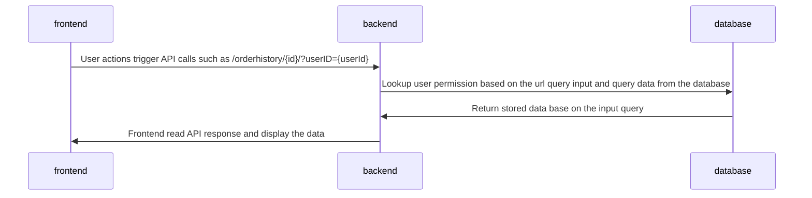

> • Discuss how you would enforce limiting users to only see their
> orders or orders that other users allowed them to see. 
> 
> • Present a guide of how someone would implement this in your project

# Introduction

At the day May 25th, 2018, General Data Protection Regulation(GDPR) became applicable[1]. This European regulation restricted how a business can collect and use user data. Since the CSI5112-Project(the project) is designed to be used by public, it is important that the project respect the regulation, so it can be used in European markets. As of today, the project does not follow the industry best practices in order to protect user's privacy due to the scope and timeline limitation of the project. This document is created to discuss future possible design iterations to address this issue. 

# Current Status 

Currently, there are a few privacy related requirements in the project:
* The buyer shall view their own order history
* The merchant shall view all buyers' order history

The current implementation to control the above discussed requirements is:

# Possible Solutions

## Pre-Task: User authentication

### Proposed Solution  
user session management with cookies/local storage

### Implementation

### Alternative Consideration
Attach user auth in every call for server side auth directly. Bad idea since plain password local variable store

### Task 1: Define Scope of All READ Operations

### Proposed Solution 
pre-db Server side filter 
 use index, less compute, may skip query per business logic

### Implementation

### Alternative Consideration
post-db server side filter 

fe filter 

### Task 2: Error Headlining for Unauthorised READ Operations

### Proposed Solution 

return empty results 

tell use not Unauthorised and provide solution 

prevent user from do the op

### Implementation

## Additional Privacy Assurance Enhancement 

### Physical Isolation 
db per user

### Audit Logs
recover if bad thing happened 

# Reference
[1] https://gdpr-info.eu/